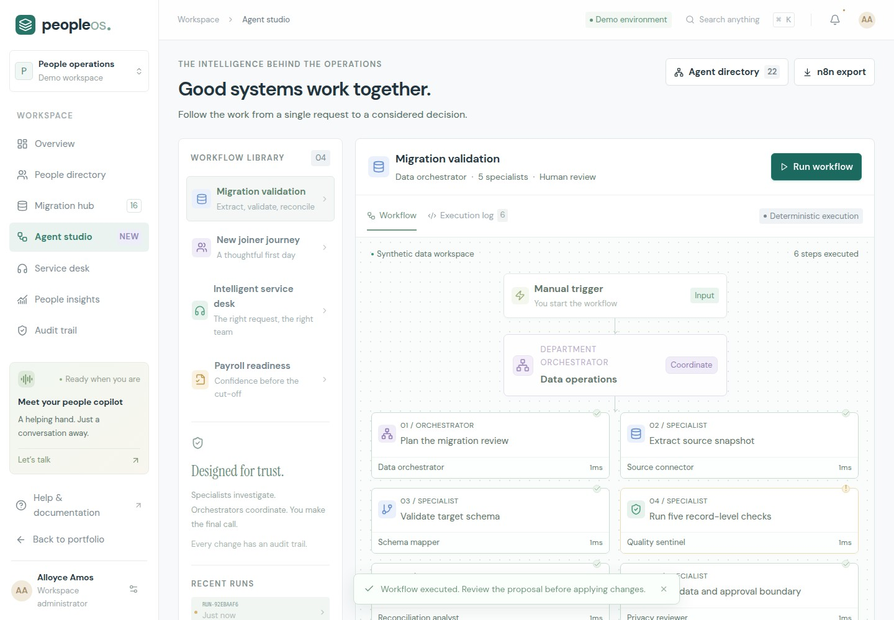

# PeopleOS

An interactive HR systems engineering case study inspired by a public Wave role.


[Live portfolio](https://alloyce-amos.duckdns.org) · [Try PeopleOS](https://alloyce-amos.duckdns.org/app) · [Live deployment notes](docs/LIVE_DEPLOYMENT.md)

[GitHub profile](https://github.com/amosalloyce) · [PeopleOS source](https://github.com/AmosAlloyce/peopleos) · [FinPulse source](https://github.com/AmosAlloyce/FinPulse) · [Design and typography](docs/DESIGN.md) · [Interview case study](docs/CASE_STUDY.md) · [Architecture](docs/ARCHITECTURE.md) · [Research](docs/RESEARCH.md) · [Oracle/DuckDNS deployment](docs/DEPLOYMENT.md)

PeopleOS uses 48 fictional employee records across 13 countries. It demonstrates migration controls, service operations, approval workflows, analytics, and optional AI explanations. It is an independent portfolio project, not a Wave product or Workday integration.

FinPulse processes synthetic GSM, mobile-money, and loan events across Kenya, Uganda, Ghana, Tanzania, and Zambia. Its Python service applies event contracts and quality rules, quarantines invalid data, and exposes bronze/silver/gold processing, lineage, and portfolio aggregates. It uses synthetic data to demonstrate engineering behavior; it does not make lending decisions about real people.

| Project | Interface | Source and runtime |
| --- | --- | --- |
| PeopleOS | `/app` | This repository; React, Express, SQLite, optional Groq |
| FinPulse | `/finpulse/` in the combined deployment | [Separate FinPulse repository](https://github.com/AmosAlloyce/FinPulse); React, Python/FastAPI, SQLite |

Running this repository alone starts the portfolio and PeopleOS. FinPulse needs its separate service and frontend; the shared host routes `/finpulse/` to that service.

[](https://alloyce-amos.duckdns.org/demo/peopleos-demo.mp4)

[Watch the PeopleOS walkthrough](https://alloyce-amos.duckdns.org/demo/peopleos-demo.mp4), or explore the [live workspace](https://alloyce-amos.duckdns.org/app). The portfolio provides a separate walkthrough control for each project, with the corresponding video, poster, and captions. PeopleOS includes Docker/Caddy deployment and an n8n workflow export.

## Run locally

Requires Node.js 22 and npm.

```sh
npm ci
cp .env.example .env
npm run dev
```

Open the Vite URL printed in the terminal, normally `http://localhost:5173`. The portfolio is at `/`; PeopleOS is at `/app`. The API runs on port 3001. If `.env` already exists, edit it rather than copying over it. No API key is needed.

For the production build:

```sh
npm run build
npm start
```

Open `http://localhost:3001`. Docker/Caddy instructions are in [DEPLOYMENT.md](docs/DEPLOYMENT.md).

## Try the PeopleOS flow

1. Open the dashboard and inspect the synthetic dataset and data-quality issues.
2. Run a migration analysis. Inspect the field-level changes and each specialist's output.
3. Approve the proposal. The dataset, issue count, quality metric, and audit history update together.
4. Try onboarding, service-desk routing, or payroll readiness in the workflow view.
5. Create a support request, filter the employee directory, and export its synthetic data.
6. Ask the assistant to explain migration checks or a sample onboarding policy. Choose English/French and a persona; use supported browser voice controls or text.

Each browser session has isolated state and expires after two hours of inactivity. Resetting the demo affects that workspace. Set `DATA_DIR` to retain unexpired sessions in SQLite across restarts; without it, state is memory-only. Docker Compose enables persistence in a named volume. The workflow registry shows 4 orchestrators and 18 specialists implemented as bounded tool responsibilities. They do not represent 22 continuously running LLMs.

The migration CSV preview parses and validates supplied synthetic rows without committing them to the employee directory. This gives an inspectable import boundary without pretending that an external HRIS is connected.

## Optional live AI

Set `GROQ_API_KEY` in `.env` and restart the API. `GROQ_MODEL` defaults to `openai/gpt-oss-20b`; verify access in your account. Successful live responses are labeled, and unavailable AI falls back to the deterministic assistant. The provider key stays on the server. The app sends aggregate context and fictional handbook content; model output cannot approve or apply changes.

Speech recognition and available voices depend on the browser and device. Microphone input requires explicit user action and may use the browser provider's speech service. Text interaction works without microphone access.

## Workflow export and recorded walkthrough

Import [the n8n workflow](public/workflows/peopleos-migration.json) into an existing n8n instance and set its base URL. It checks the service, creates a visitor session, runs migration checks, and stops with a reviewable proposal. [Import instructions](public/workflows/README.md)

The updated recording pipeline uses natural neural narration and chapter timing for approximately two-minute product walkthroughs. The measured narration tracks are 118.04 seconds for PeopleOS and 113.22 seconds for FinPulse. See [NARRATION.md](docs/NARRATION.md) for the provider, synthetic voice disclosure, production procedure, and verification limits.

The portfolio selects project-specific media:

| Project | Video and captions | Poster and workspace preview |
| --- | --- | --- |
| PeopleOS | `public/demo/peopleos-demo.mp4`, `peopleos-demo.vtt` | `poster.jpg`, `workspace.jpg` |
| FinPulse | `public/demo/finpulse-demo.mp4`, `finpulse-demo.vtt` | `finpulse-poster.jpg`, `finpulse-workspace.jpg` |

To regenerate PeopleOS after UI changes, generate the neural narration, start the app, and run `npm run record:demo`. The recorder uses the measured chapter schedule; it does not silently regenerate speech or substitute the older voice. Run `scripts/check-media.mjs` against the running build to verify the assembled video rather than assuming the audio track alone proves a complete recording. FinPulse is captured against its separate running application.

The earlier `scripts/generate-narration.py` Flite helper remains available for offline experiments. It is not the neural narration used by the revised recording pipeline.

## Validation

```sh
npm test
npm run build
npm run test:browser
npm run test:portfolio
```

Browser checks and recording require Playwright's Chromium installation. Where browsers are not already available, install with `npx playwright install chromium`. The API tests cover the real demo logic and boundaries; browser checks exercise the rendered user journey. Review the scripts for configurable browser/module paths when using a shared local Playwright installation.

Use `BASE_URL=http://127.0.0.1:3001` to test a running production build. Set `BROWSER_PATH` to an existing Chromium-compatible executable if you have one; otherwise the scripts use Playwright's installed Chromium. Recording also requires `npx playwright install ffmpeg` and the system `ffmpeg` binary. The revised narration scripts are `docs/peopleos-neural-script.json` and `docs/finpulse-neural-script.json`; generated chapter timing drives the recordings and WebVTT captions.

The site self-hosts DM Sans and Instrument Serif. Their SIL Open Font License files are included in `public/fonts/`. The [editable Figma concept](https://www.figma.com/design/nLV1ERYhMlA8zazfGYpc9h?node-id=2-2) informed the larger typography: 16px workspace body, 15px primary controls, and 18px desktop portfolio paragraphs. Responsive layouts reflow instead of shrinking the body text.

## Project layout

| Path | Responsibility |
| --- | --- |
| `src/` | Portfolio and PeopleOS interface |
| `server/` | Synthetic fixtures, workflow tools, sessions, chat adapter, API |
| `test/` | API and workflow checks |
| `scripts/` | Development, browser validation, recorded demo |
| `public/demo/` | Project walkthroughs, captions, posters, and workspace previews |
| `public/workflows/` | Portable n8n workflow and usage notes |
| `deploy/`, `compose.yaml`, `Dockerfile` | Container and HTTPS deployment configuration |
| `docs/` | Architecture, research, design decisions, narration, deployment guidance |

Production HR use requires real authentication and authorization, durable storage, validated policies, operational controls, and approved integrations. Sample rules do not establish GDPR, CCPA, payroll, or country-law compliance. No real employee records belong in this public demo.
