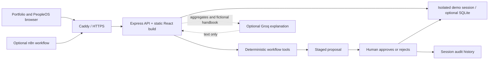

# PeopleOS architecture

PeopleOS combines Alloyce Amos's portfolio with a working HR systems case study. The application demonstrates data reconciliation, inspectable orchestration, human approval, and support workflows on **48 fictional employee records across 13 countries**. It has no production HRIS connection.

## Request path

React/Vite serves `/` and `/app` with deep links under `/app/:section`. Express serves JSON under `/api`, the built assets, and the SPA fallback. The development Vite proxy sends API requests to port 3001. A production image serves both on the same origin.

## Agent hierarchy

The registry has **4 orchestrators and 18 specialists**. These are explicit responsibilities within the application, implemented through bounded tool functions and workflow routing. They are not 22 independent model services or autonomous workers. The same deterministic path executes with or without an AI key.

| Coordinator | Specialists and responsibility |
| --- | --- |
| Data orchestrator | Source connector, schema mapper, quality sentinel, reconciliation analyst |
| People orchestrator | Identity checker, access planner, learning planner, onboarding coordinator |
| Service orchestrator | Request classifier, policy librarian, routing specialist, response drafter |
| Payroll orchestrator | Country mapper, payroll readiness analyst, exception triage, reporting analyst |
| Shared controls | Privacy reviewer and audit recorder apply across the workflows |

An orchestrator chooses the predefined scenario, collects step results, and returns a structured proposal. A step records its responsible specialist, operation, output, status, and measured duration. The visual workflow presents that trace. Timing is local execution time; it is not an invented savings or model-performance metric.

## Four executable scenarios

**Migration:** copy the current synthetic roster, inspect target fields, run five checks per record, stage fixture-backed corrections, validate the proposed target, and preserve employee identifiers and counts. Approval applies the exact reviewed changes. Stale proposals fail if the relevant source values or issue status changed. A separate CSV dry-run endpoint parses and validates up to 500 synthetic rows, returning mappings, preview data, and issues without committing imported workers.

**Onboarding:** select a pending fictional starter, validate required fields, construct an access and learning checklist, and stage the handoff. Approval activates the synthetic profile and creates a checklist ticket. It does not provision a real account.

**Service desk:** read unassigned requests, map explicit categories to demo teams, retrieve fictional handbook guidance, and draft acknowledgements. Approval changes local assignment/status. It sends no external message.

**Payroll readiness:** reconcile country codes, start dates, and manager references, group exceptions, and prepare a report. Approval creates a review ticket. Salaries, tax calculations, bank details, and payments are outside this implementation.

## State and approval semantics

The server issues an opaque `peopleos_session` cookie with HttpOnly and SameSite attributes. Each visitor receives a separate synthetic workspace. HTTPS cookies are Secure. The store is bounded to 250 sessions and expires sessions after two hours of inactivity. Without `DATA_DIR`, it lives in memory and process restarts reset state. Setting `DATA_DIR` enables Node 22's built-in SQLite storage for unexpired session state and rate counters. Compose mounts a named volume at `/app/data`; expiry and reset semantics still apply. An optional `N8N_API_TOKEN` provides a dedicated automation workspace, while the included n8n workflow uses cookie forwarding.

Workflow execution stores an `awaiting_approval` proposal and an audit event. The approval endpoint accepts only `approve` or `reject`, checks that the run is undecided, preflights the proposal, and then applies its bounded mutation. Repeated decisions fail. An ordinary demo visitor is the reviewer of their own sample state; this is not proof of enterprise authorization or separation of duties.

Issues, headcount, open tickets, run status, and quality percentage come from session data. Quality is the percentage of workers without any open seeded issue, not the pass rate of every possible business rule. CSV export applies formula-injection protection. Audit events belong to the same expiring session and are not immutable compliance records. SQLite improves demonstration continuity; it is not a shared transactional worker database or distributed job system.

## AI and voice boundary

The optional Groq adapter receives aggregate counts, the user's message, and fictional policy context. It never receives the full employee roster. It generates explanations and conversational responses; deterministic tools and the approval endpoint control state. No automatic hiring, performance scoring, dismissal, or compensation decision exists.

The chat response states the mode actually used. Missing credentials, provider failure, or exhausted limits fall back to the local response. The health endpoint only reports live capability after a successful provider response. A configured key by itself is not a successful AI integration.

CSV preview accepts at most 500 rows and 256 KB of text, normalizes recognized headers, validates required fields and values, and reports errors with row and field context. It checks duplicate identifiers/emails, country codes, the department taxonomy, real calendar dates, manager references, and spreadsheet formulas. Only fictional `peopleos.example` addresses are accepted. The preview returns the first five rows and an aggregate summary, records an audit event, and writes no employee records. CSV contents are not sent to the model provider.

The browser offers concierge, analyst, and onboarding personas. Speech recognition creates an editable transcript, and speech synthesis can read a response. The user initiates voice interaction. Available languages and voices depend on the browser/device; recognition may use the browser vendor's servers. Text is always an alternative. The backend does not accept or store raw voice audio.

## Interfaces

| Endpoint | Purpose |
| --- | --- |
| `GET /api/health` | Read service status and provider mode |
| `GET /api/workspace` | Initialize/read the visitor's synthetic workspace |
| `POST /api/runs` | Execute migration, onboarding, service-desk, or payroll checks |
| `POST /api/runs/:id/approve` | Apply or reject the reviewed proposal |
| `POST /api/chat` | Request a source-grounded demo or optional live response |
| `POST /api/tickets` | Create an internal sample request |
| `POST /api/reset` | Reset the current synthetic workspace |
| `GET /api/export` | Download a safe synthetic CSV |
| `POST /api/import` | Parse and validate a bounded synthetic CSV without committing workers |

See [the shared contract](CONTRACT.md) and server implementation for exact payloads. The [n8n export](../public/workflows/peopleos-migration.json) uses those same endpoints; it does not tunnel arbitrary upstream requests through the API.

## Path to a real deployment

The following are future requirements, not capabilities claimed by the demo:

1. Replace anonymous visitor sessions with SSO, scoped roles, country-aware access, and separately authorized approvers.
2. Store records and proposals transactionally; add stable source IDs, idempotency keys, durable jobs, reconciliation checkpoints, retention, backup/restore, and protected audit logs.
3. Build a Workday tenant adapter with reviewed security domains, service versions, mappings, sandbox credentials, staged imports, rejected-row handling, and rollback/cutover procedures.
4. Have the relevant policy owners validate country rules, lawful processing, access, retention, and provider data handling before introducing real employee data.
5. Add contract tests against actual integrations, representative load tests, operational alerts, AI evaluation datasets, prompt/version tracking, and measured latency/cost targets.

These changes enable discussion of a 5,000+ employee environment. The demo itself makes no tested scalability claim at that size. Research and primary sources are in [RESEARCH.md](RESEARCH.md).
